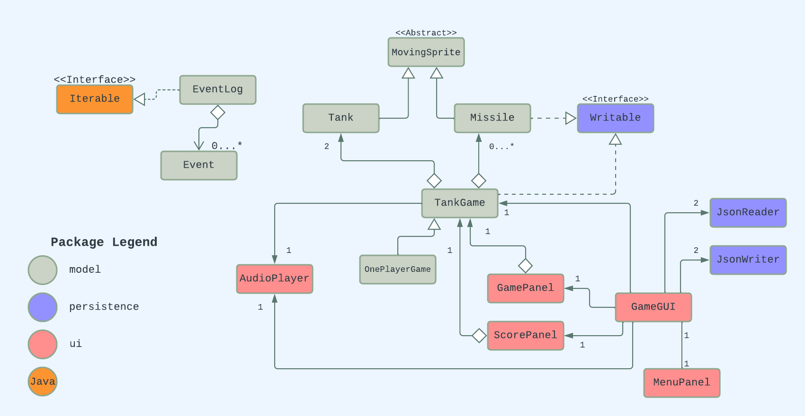

# Tank Battles 

> ### Aidan Meharg
> #### UBC CPSC 210 2022

### About

This application is a simple competitive game with the goal of 
taking down your opponent.

Both players will operate their respective tanks with their own 
keyboard commands:
- Player 1 using **"w, a, s, d"** keys for movement and **spacebar** to shoot
- Player 2 using **arrow** keys for movement and **"<"** to shoot
- Players may save their current game at any time by pressing **"t"**

Each player will begin with 3 lives which can be lost in 2 ways:
- Driving your vehicle into the boundaries (edge of screen)
- Getting hit by missiles launched by the opponent

Once a player has lost all 3 lives, their opponent is proclaimed victorious!

I decided upon this project idea because I have had so much fun in the 
past playing simple 2-player games (ex. Fireboy and Watergirl, Tanks 2 etc.)

### Screenshots

### User Stories

- As a user, I want to be able to fire multiple missiles from my tank and see them rendered within the game panel
  (adding missiles to the TankGame)
- As a user, I want to be able to keep track of how much health my tank has left
- As a user, I want to take damage when enemy missiles collide with my tank
- As a user, I want my tank to be bounded by the edges of the screen, and take damage if I try to drive 
out of the screen
- As a user, I want to have a cooldown period after firing my tank's cannon which restricts me from firing infinitely
many consecutive shots
- As a user, I want to be able to save and quit my current game
- As a user, I want to have the option to load the previous game, or start a new one

### Class UML Diagram

### Refactoring to improve design:

- apply singleton design pattern to the AudioPlayer class
-> at no point should there be more than one AudioPlayer instantiated, it should also be globally accessible
- change implementation of JsonReader + JsonWriter classes to accept more than one source file
  (not great having 2 readers and writers within the GUI to open 2 types of game)
- make Tank class implement Writable interface to make write() method in TankGame less clunky and more 
adaptable to future changes
- implement the observer pattern to TankGame and ScorePanel to reduce coupling

  
